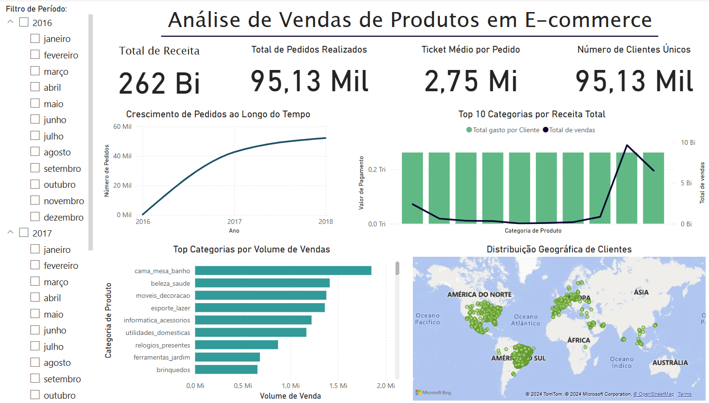

# Análise de Vendas de Produtos em E-commerce

## Descrição

Este dashboard apresenta uma análise detalhada das vendas de produtos em um e-commerce, fornecendo uma visão abrangente sobre o desempenho das vendas, comportamento dos clientes e categorias de produtos mais rentáveis. As métricas principais incluem receita total, volume de vendas por categoria, número de pedidos realizados, ticket médio por pedido e a distribuição geográfica dos clientes.

Confira o [projeto publicado](https://app.powerbi.com/groups/me/reports/5b0bd796-cd80-45d7-ab0e-b5ca67b74a98/ed5fa4fccdb9c0ba3990?bookmarkGuid=16787675-b96f-438b-8909-647cd3e049b8&bookmarkUsage=1&ctid=cf72e2bd-7a2b-4783-bdeb-39d57b07f76f&portalSessionId=e7310439-bbcd-4b17-8c14-146050ef0c72&fromEntryPoint=export).

## Objetivo

O objetivo deste dashboard é fornecer insights sobre as vendas de produtos em um período específico, ajudando a identificar tendências de vendas, categorias mais populares, o comportamento de clientes e a evolução das métricas ao longo do tempo.

## Estrutura do Dashboard

O dashboard é composto pelas seguintes seções e visualizações:

### 1. **Métricas Principais**
   - **Total de Receita**: O valor total gerado pelas vendas durante o período selecionado.
   - **Total de Pedidos Realizados**: O número total de pedidos feitos pelos clientes no período.
   - **Ticket Médio por Pedido**: O valor médio por pedido no período.
   - **Número de Clientes Únicos**: A quantidade total de clientes distintos que realizaram compras no período.

### 2. **Evolução de Pedidos ao Longo do Tempo**
   - Este gráfico exibe o crescimento do número de pedidos realizados ao longo dos anos (2016-2018), permitindo analisar a tendência de aumento ou diminuição nas compras.

### 3. **Top 10 Categorias por Receita Total**
   - Apresenta as 10 principais categorias de produtos em termos de receita total gerada. A visualização permite identificar quais categorias estão gerando mais receita durante o período analisado.

### 4. **Top Categorias por Volume de Vendas**
   - Exibe as categorias de produtos com o maior volume de vendas, ou seja, a quantidade de unidades vendidas. Isso ajuda a identificar quais categorias estão sendo mais procuradas pelos clientes, independentemente da receita gerada.

### 5. **Distribuição Geográfica de Clientes**
   - Mostra a localização geográfica dos clientes em um mapa interativo. Esta visualização oferece uma visão sobre a distribuição global dos consumidores, ajudando a entender em quais regiões o e-commerce possui maior penetração.

## Filtros e Interatividade

- **Filtro de Período**: Permite selecionar o período de tempo a ser analisado (ano e mês). Isso proporciona uma análise dinâmica das métricas e visualizações conforme o período escolhido.
- **Interatividade nos Gráficos**: O usuário pode interagir com os gráficos para explorar os dados de forma mais detalhada, focando em categorias específicas ou observando o comportamento ao longo do tempo.

## Insights Extraídos

1. **Crescimento de Pedidos ao Longo do Tempo**:
   - O número de pedidos aumentou de forma consistente de 2016 a 2018, indicando que o e-commerce está em expansão.
   - É possível observar picos em determinados anos, que podem estar relacionados a campanhas de marketing ou sazonalidade.

2. **Top 10 Categorias por Receita Total**:
   - As categorias que mais geram receita não são necessariamente as que possuem o maior volume de vendas. Isso sugere que, embora algumas categorias tenham muitas vendas, outras com preços mais altos ou margens melhores podem ter gerado maior receita.

3. **Volume de Vendas por Categoria**:
   - Algumas categorias, como **"cama_mesa_banho"**, **"beleza_saude"** e **"moveis_decoracao"**, possuem um volume significativo de vendas. Isso pode indicar uma tendência de preferências dos consumidores por certos tipos de produtos.

4. **Distribuição Geográfica dos Clientes**:
   - O e-commerce possui uma forte presença na **América do Norte** e **Europa**, mas também está expandindo para outras regiões como **Ásia** e **África**. Isso pode abrir oportunidades para campanhas de marketing focadas nessas regiões em crescimento.

5. **Ticket Médio e Total Gasto por Cliente**:
   - O ticket médio por pedido está em **R$ 2,75 milhões**, e o total gasto por cliente segue uma tendência crescente, refletindo que os consumidores estão gastando mais por compra ao longo do tempo.

## Tecnologias Utilizadas

- **Power BI**: Ferramenta de visualização de dados utilizada para criar os gráficos e dashboards interativos.
- **Excel/CSV**: Fontes de dados para alimentar o dashboard, com informações sobre pedidos, categorias de produtos e clientes.
- **Mapas Interativos**: Utilização de dados geográficos para ilustrar a distribuição global dos clientes.

## Conclusão

Este dashboard fornece uma visão completa e detalhada das vendas e comportamento dos clientes de um e-commerce. Ele ajuda a identificar as áreas com maior potencial de crescimento, categorias de produtos mais rentáveis e a distribuição geográfica dos consumidores, permitindo ações estratégicas para melhorar as vendas e a experiência do cliente.

---
